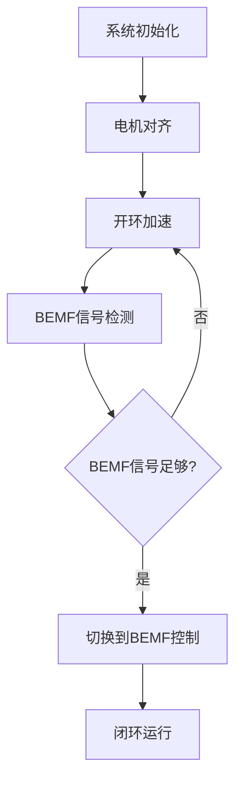

# BEMF无传感器电机控制系统技术手册

## 1. 系统概述

本系统是基于8051增强型MCU的无传感器BEMF（反电动势）三相无刷直流电机控制解决方案。系统采用六步方波控制方式，通过检测电机反电动势实现无传感器换相控制。

### 1.1 主要特性

- **无传感器控制**: 基于BEMF检测的无霍尔传感器控制
- **六步换相**: 经典的三相六步方波控制算法
- **软启动**: 开环到闭环的平滑切换启动序列
- **多重保护**: 过流、过压、过温、堵转等完善的保护功能
- **高精度控制**: 12位ADC配合硬件比较器实现精确控制
- **实时监控**: UART通信接口支持参数监控和调试

### 1.2 硬件规格

| 参数 | 规格 |
|------|------|
| MCU核心 | 1T 8051增强型，24MHz |
| 存储器 | 18KB Flash, 2KB SRAM, 128B EEPROM |
| ADC | 12位分辨率，6通道 |
| 比较器 | 2个模拟比较器 |
| 运算放大器 | 1个 |
| PWM | 6通道16位专用电机PWM |
| 定时器 | 4个16位定时器 |
| 通信接口 | 2路UART, SPI |
| 调试接口 | 双两线调试 |

## 2. 系统架构

### 2.1 软件架构

```
应用层 (main.c)
├── 状态机控制
├── 速度控制 (PID)
└── 用户接口

控制层
├── BEMF控制 (bemf_control.c)
├── 启动控制 (startup.c)
└── 保护功能 (protection.c)

驱动层
├── PWM驱动 (pwm_driver.c)
├── ADC处理 (adc_handler.c)
└── 硬件抽象层
```

### 2.2 控制流程

1. **系统初始化** → 配置硬件外设和参数
2. **电机启动** → 开环控制逐步加速
3. **BEMF检测** → 切换到闭环BEMF控制
4. **速度控制** → PID闭环维持目标转速
5. **保护监控** → 实时监控系统状态

## 3. BEMF检测原理

### 3.1 工作原理

BEMF（反电动势）是电机旋转时在绕组中产生的感应电压。在三相无刷电机的六步控制中，任一时刻只有两相通电，第三相处于浮空状态。通过检测浮空相的BEMF过零点，可以确定转子位置并实现精确换相。

### 3.2 BEMF检测方法

1. **硬件检测**: 使用ADC采样浮空相电压
2. **软件滤波**: 移动平均滤波消除噪声
3. **过零检测**: 与中性点电压比较判断过零
4. **换相延迟**: 过零后延迟30度电角度换相

### 3.3 换相序列

| 步骤 | 通电相 | 检测相 | 期望极性 |
|------|--------|--------|----------|
| 0 | U+,W- | V | 正向 |
| 1 | U+,V- | W | 负向 |
| 2 | V+,W- | U | 正向 |
| 3 | V+,U- | W | 负向 |
| 4 | W+,U- | V | 正向 |
| 5 | W+,V- | U | 负向 |

## 4. 启动策略

### 4.1 启动流程



### 4.2 启动参数

| 参数 | 默认值 | 说明 |
|------|--------|------|
| 初始占空比 | 20% | 启动时的PWM占空比 |
| 对齐时间 | 50ms | 电机位置对齐时间 |
| 加速时间 | 100ms | 开环加速总时间 |
| 步进时间 | 20ms | 初始换相步进时间 |
| 切换转速 | 500RPM | 切换到BEMF控制的转速 |

### 4.3 启动保护

- **启动超时**: 防止启动时间过长
- **过流保护**: 启动电流限制
- **堵转检测**: 检测电机是否能正常启动

## 5. 保护功能

### 5.1 保护类型

1. **过流保护**: 检测电机电流超过设定阈值
2. **过压保护**: 监控母线电压过高
3. **欠压保护**: 监控母线电压过低
4. **过温保护**: 检测系统温度过高
5. **堵转保护**: 检测电机堵转状态
6. **超速保护**: 防止电机转速过高

### 5.2 保护阈值

| 保护类型 | 默认阈值 | 动作 |
|----------|----------|------|
| 过流 | 5A | 紧急停止 |
| 过压 | 48V | 软停止 |
| 欠压 | 8V | 软停止 |
| 过温 | 85°C | 功率限制 |
| 堵转 | 2秒 | 紧急停止 |
| 超速 | 5000RPM | 功率限制 |

### 5.3 保护动作

- **紧急停止**: 立即关闭所有PWM输出
- **软停止**: 逐步减少PWM占空比直到停止
- **功率限制**: 限制最大PWM占空比

## 6. 参数配置

### 6.1 电机参数

```c
// 电机基本参数
#define MOTOR_POLE_PAIRS    4           // 电机极对数
#define STARTUP_DUTY        20          // 启动占空比 (%)
#define MAX_DUTY_CYCLE      90          // 最大占空比 (%)
#define MIN_DUTY_CYCLE      5           // 最小占空比 (%)

// BEMF检测参数
#define BEMF_THRESHOLD      512         // BEMF检测阈值 (ADC值)
#define BEMF_FILTER_COUNT   3           // BEMF滤波计数
#define COMMUTATION_DELAY   30          // 换相延迟 (us)
```

### 6.2 保护参数

```c
// 保护阈值
#define MAX_CURRENT         5000        // 最大电流 (mA)
#define MAX_VOLTAGE         48000       // 最大电压 (mV)
#define MAX_TEMPERATURE     85          // 最大温度 (°C)
#define STALL_TIMEOUT       2000        // 堵转超时 (ms)
```

### 6.3 控制参数

```c
// PWM参数
#define PWM_FREQUENCY       20000       // PWM频率 (Hz)
#define DEAD_TIME           2           // 死区时间 (us)

// 速度控制参数
#define SPEED_KP            2           // 比例系数
#define SPEED_KI            10          // 积分系数
#define SPEED_KD            1           // 微分系数
```

## 7. 硬件连接

### 7.1 PWM输出连接

| MCU引脚 | 功能 | 连接 |
|---------|------|------|
| P1.0 | PWM_U_HIGH | U相上桥臂 |
| P1.1 | PWM_U_LOW | U相下桥臂 |
| P1.2 | PWM_V_HIGH | V相上桥臂 |
| P1.3 | PWM_V_LOW | V相下桥臂 |
| P1.4 | PWM_W_HIGH | W相上桥臂 |
| P1.5 | PWM_W_LOW | W相下桥臂 |

### 7.2 ADC输入连接

| ADC通道 | 功能 | 连接 |
|---------|------|------|
| AN0 | BEMF_U | U相BEMF检测 |
| AN1 | BEMF_V | V相BEMF检测 |
| AN2 | BEMF_W | W相BEMF检测 |
| AN3 | CURRENT | 电流检测 |
| AN4 | VOLTAGE | 电压检测 |
| AN5 | TEMPERATURE | 温度检测 |

### 7.3 通信接口

| 接口 | 功能 | 连接 |
|------|------|------|
| UART1 | 调试通信 | PC调试接口 |
| UART2 | 外部通信 | 上位机通信 |
| SPI | 参数存储 | EEPROM |

## 8. 调试和测试

### 8.1 调试接口

系统提供UART调试接口，可以实时监控以下参数：
- 电机转速 (RPM)
- PWM占空比 (%)
- 电机电流 (mA)
- 母线电压 (V)
- 系统温度 (°C)
- 运行状态
- 故障信息

### 8.2 测试步骤

1. **硬件连接测试**
   - 检查PWM输出波形
   - 验证ADC采样精度
   - 测试保护功能

2. **启动测试**
   - 验证电机对齐功能
   - 测试开环启动过程
   - 检查BEMF切换时机

3. **运行测试**
   - 测试速度控制精度
   - 验证负载响应特性
   - 检查保护功能有效性

### 8.3 常见问题

| 问题 | 可能原因 | 解决方法 |
|------|----------|----------|
| 启动失败 | BEMF阈值设置不当 | 调整BEMF_THRESHOLD |
| 运行不稳定 | 滤波参数不合适 | 调整BEMF_FILTER_COUNT |
| 频繁保护 | 保护阈值过低 | 适当提高保护阈值 |
| 换相错误 | 相序连接错误 | 检查电机相序连接 |

## 9. 性能指标

### 9.1 控制性能

- **转速范围**: 100-5000 RPM
- **转速精度**: ±1%
- **响应时间**: <100ms
- **效率**: >90% (额定负载)

### 9.2 保护性能

- **过流响应时间**: <1ms
- **过压响应时间**: <10ms
- **过温响应时间**: <100ms
- **堵转检测时间**: 2s (可调)

### 9.3 系统可靠性

- **MTBF**: >10000小时
- **工作温度**: -20°C ~ +85°C
- **存储温度**: -40°C ~ +125°C
- **湿度**: 5% ~ 95% RH (无凝露)

## 10. 维护和升级

### 10.1 参数备份

系统支持将关键参数存储到EEPROM中，包括：
- 电机参数
- 保护阈值
- 校准数据
- 运行统计

### 10.2 固件升级

支持通过UART接口进行固件在线升级，升级过程：
1. 进入升级模式
2. 传输新固件
3. 校验和验证
4. 重启应用新固件

### 10.3 故障诊断

系统提供完善的故障诊断功能：
- 故障代码记录
- 运行时间统计
- 故障次数统计
- 系统自检功能

---

**注意**: 本手册基于标准配置编写，实际应用时请根据具体硬件平台和电机参数进行相应调整。